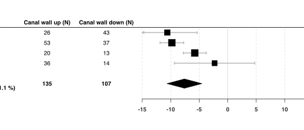
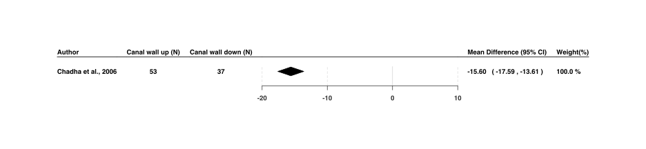
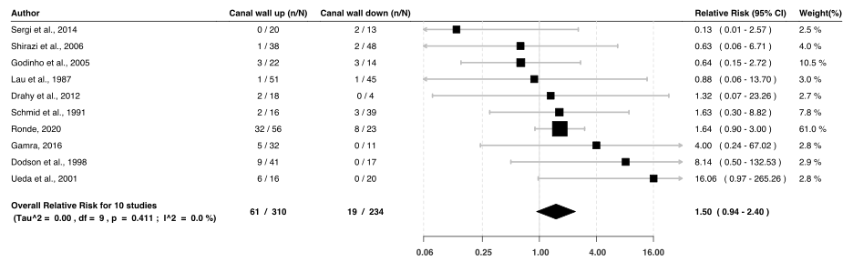
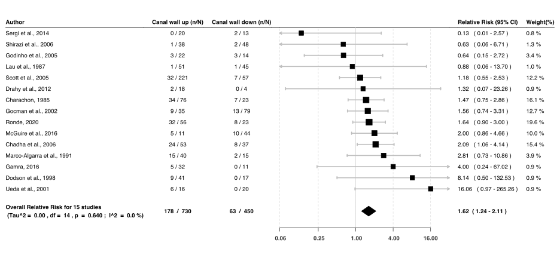

Cholesteatoma
================
Oscar J. Ponce & Paola Solis-Pazmino
06/11/2020

## Open Data

> Click any of the following links to view the documents

|        Stage        |                                                                                                                                                                                File                                                                                                                                                                                 |
| :-----------------: | :-----------------------------------------------------------------------------------------------------------------------------------------------------------------------------------------------------------------------------------------------------------------------------------------------------------------------------------------------------------------: |
|      Protocol       |                                                                                                                                         [PROSPERO](https://www.crd.york.ac.uk/prospero/display_record.php?RecordID=184029)                                                                                                                                          |
|   Search strategy   |                                                                                 [Ovid](https://github.com/ponceoscarj/Cholesteatoma/blob/main/2%20Search%20Strategy/ovid.csv) and [Scopus](https://github.com/ponceoscarj/Cholesteatoma/blob/main/2%20Search%20Strategy/scopus.csv)                                                                                 |
| Abstract screening  |   [Total Articles = 1024](https://github.com/ponceoscarj/Cholesteatoma/blob/main/3%20Articles%20for%20Abstract%20Screening/AbstractScreening_TotalStudies.txt), [Excluded Articles = 780](https://github.com/ponceoscarj/Cholesteatoma/blob/main/3%20Articles%20for%20Abstract%20Screening/AbstractScreening_ExcludedStudies.txt), **`Included Articles = 247`↓**   |
| Full-text screening | [Total Articles = 247](https://github.com/ponceoscarj/Cholesteatoma/blob/main/4%20Articles%20for%20Full%20Text%20Screening/FulltextScreening_TotalStudies.txt), [Excluded Articles = 230](https://github.com/ponceoscarj/Cholesteatoma/blob/main/4%20Articles%20for%20Full%20Text%20Screening/FulltextScreening_ExcludedStudies.txt), **`Included Articles = 17`↓** |
|   Data Extraction   |                                                                                                      [Total Articles = 17](https://github.com/ponceoscarj/Cholesteatoma/blob/main/5%20Included%20Articles%20for%20Data%20Extraction/IncludedStudies_SRMA.txt)                                                                                                       |
|  Raw Outcome data   |                                                                                                                           [Available as `.CSV`](https://github.com/ponceoscarj/Cholesteatoma/blob/main/6%20Extracted%20Data/outcomes.csv)                                                                                                                           |
|   Analysis codes    |                                                                                                                                 [Script as `R Markdown`](https://github.com/ponceoscarj/Cholesteatoma/blob/main/Cholesteatoma.Rmd)                                                                                                                                  |

## Forest plots

### Figure 2

<b>Show figure -</b> Differences in <b>Air Bone Gap (db)</b>
after <b>Canal Wall Up</b> versus <b>Canal Wall Down</b>

<!-- -->

### Figure 3

<b>Show figure -</b> Difference in <b>Air Conduction (Hz)</b>
after <b>Canal Wall Up</b> versus <b>Canal Wall Down</b>

<!-- -->

### Figure 4

<b>Show figure -</b> Risk of <b>Recurrence</b> after <b>Canal
Wall Up</b> versus <b>Canal Wall Down</b>

<!-- -->

### Figure 5

<b>Show figure -</b> Risk of <b>Residual Tissue</b> after
<b>Canal Wall Up</b> versus <b>Canal Wall Down</b>

<!-- -->

### Figure 6

<b>Show figure -</b> Risk of <b>Recidivism</b> after <b>Canal
Wall Up</b> versus <b>Canal Wall Down</b>

<!-- -->

